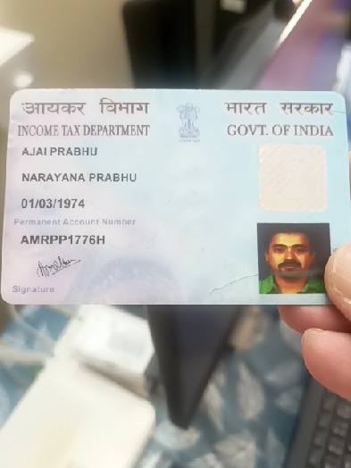
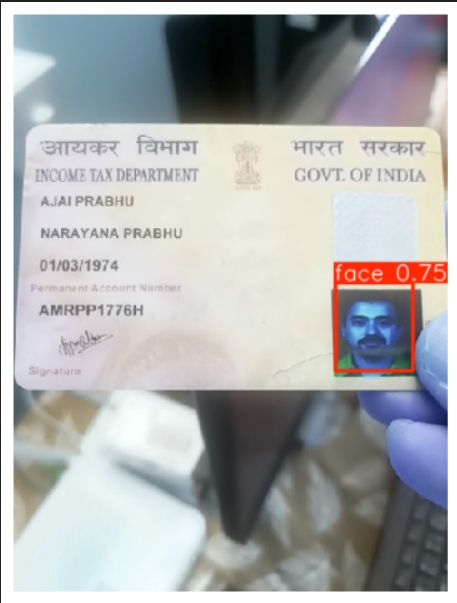
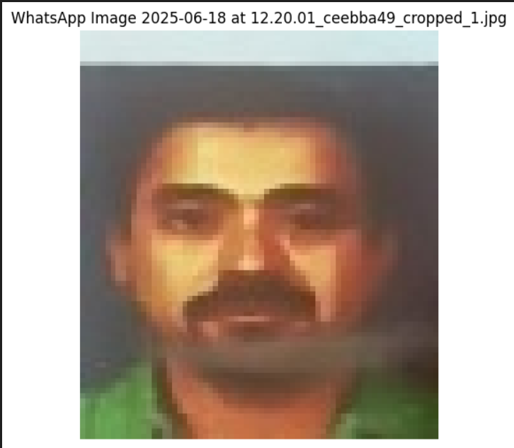

# Face Detection Project

This project implements a face detection system using YOLOv8 (Ultralytics). It includes data preparation, model training, validation, and inference with face cropping capabilities.

## Overview

The project processes a dataset of face images, prepares YOLO-format labels, trains a YOLOv8 model for face detection, and performs inference on test images. It also includes functionality to crop detected faces and save them as separate images.

## Dataset

- **Source**: `dataset/faces.csv` (annotations) and `dataset/images/` (image files)
- **Annotations**: Bounding box coordinates (x0, y0, x1, y1) for faces in each image
- **Data Split**: 80% train, 10% validation, 10% test
- **Image Size**: Resized to 640x640 pixels for YOLO training

## Setup

### Prerequisites

- Python 3.x
- Jupyter Notebook
- Required libraries:
  - ultralytics
  - opencv-python
  - pandas
  - numpy
  - matplotlib
  - pillow
  - shutil

### Installation

1. Clone or download the project repository.
2. Install dependencies:
   ```bash
   pip install ultralytics opencv-python pandas numpy matplotlib pillow
   ```
3. Ensure the dataset files are in the correct paths as referenced in the notebook.

## Data Preparation

The notebook performs the following data preparation steps:

1. **Load Dataset**: Read annotations from `faces.csv`
2. **Data Splitting**: Randomly split images into train/val/test sets
3. **Label Conversion**: Convert bounding box coordinates to YOLO format (normalized center coordinates and dimensions)
4. **Image Resizing**: Resize all images to 640x640 pixels
5. **File Organization**: Move images and labels to respective train/val/test directories
6. **Config Generation**: Create `config.yaml` for YOLO training

## Training

- **Model**: YOLOv8n (nano) loaded with yolov8s.pt weights
- **Epochs**: 20
- **Device**: CPU (can be changed to GPU if available)
- **Hyperparameters**: IoU=0.5, conf=0.001
- **Output**: Trained model saved as `best_yolov8_model.pt`

## Validation

- Evaluates the trained model on the validation set
- Computes Mean Average Precision (mAP)
- Generates training curves and results visualizations

## Inference

The project includes inference capabilities:

1. **Prediction on Test Images**: Runs detection on images in `images/test/`
2. **Face Cropping**: Extracts detected faces and saves them to `dataset/test_images_2_cropped/`
3. **Visualization**: Displays original images with bounding boxes and cropped faces
4. **Batch Processing**: Processes multiple images and creates a zip archive of cropped faces

## Results

- **Training Results**: Stored in `runs/detect/train62/` (or similar)
- **Metrics**: mAP scores, precision, recall curves
- **Visualizations**: F1 curve, P/R curves, confusion matrix
- **Cropped Faces**: Saved in `dataset/test_images_2_cropped/` and zipped

## Screenshots

### Input vs Output Images

The notebook includes visualizations comparing input images to detection outputs. Below are placeholders for screenshots:

- **Input Image**: Original image without detections
  
  

- **Output Image**: Image with detected faces highlighted (bounding boxes)
  
  

- **Cropped Faces**: Extracted face regions from detections
  
  

*Note: Capture screenshots from the notebook's visualization cells (e.g., after running prediction on test images) and replace the placeholder paths with actual image files.*

## Usage

### Running the Notebook

1. Open `face_detection_notesbooks/face_detector_5.ipynb` in Jupyter Notebook
2. Execute cells in order to:
   - Prepare data
   - Train the model
   - Validate and visualize results
   - Run inference on test images

### Using the Trained Model

```python
from ultralytics import YOLO

# Load the trained model
model = YOLO('best_yolov8_model.pt')

# Predict on an image
results = model.predict('path/to/image.jpg')

# Display results
for result in results:
    result.show()
```

### Cropping Faces from New Images

```python
import cv2

# Load image
image = cv2.imread('path/to/image.jpg')

# Run prediction
results = model.predict(image)[0]

# Crop detected faces
for i, box in enumerate(results.boxes.xyxy):
    x1, y1, x2, y2 = map(int, box.cpu().numpy())
    cropped = image[y1:y2, x1:x2]
    cv2.imwrite(f'cropped_face_{i+1}.jpg', cropped)
```

## File Structure

```
/home/suman/internship Geogo/project-5 Face detection/
├── face_detection_notesbooks/
│   └── face_detector_5.ipynb
├── dataset/
│   ├── faces.csv
│   ├── images/
│   ├── test_images_2/
│   └── test_images_2_cropped/
├── images/
│   ├── train/
│   ├── val/
│   └── test/
├── labels/
│   ├── train/
│   ├── val/
│   └── test/
├── models/
│   └── best_yolov8_model.pt
├── results/
├── runs/
├── config.yaml
└── README.md
```

## Notes

- The model is trained on CPU; for faster training, use GPU if available
- Adjust hyperparameters in the training cell as needed
- The notebook includes visualization of sample images and detection results
- Cropped faces are saved with unique filenames to handle multiple faces per image

## Future Improvements

- Implement data augmentation for better model generalization
- Add face recognition capabilities
- Optimize model for real-time detection
- Integrate with web/mobile applications

## License

This project is for educational and research purposes. Please ensure compliance with data usage policies and privacy regulations when working with face images.
